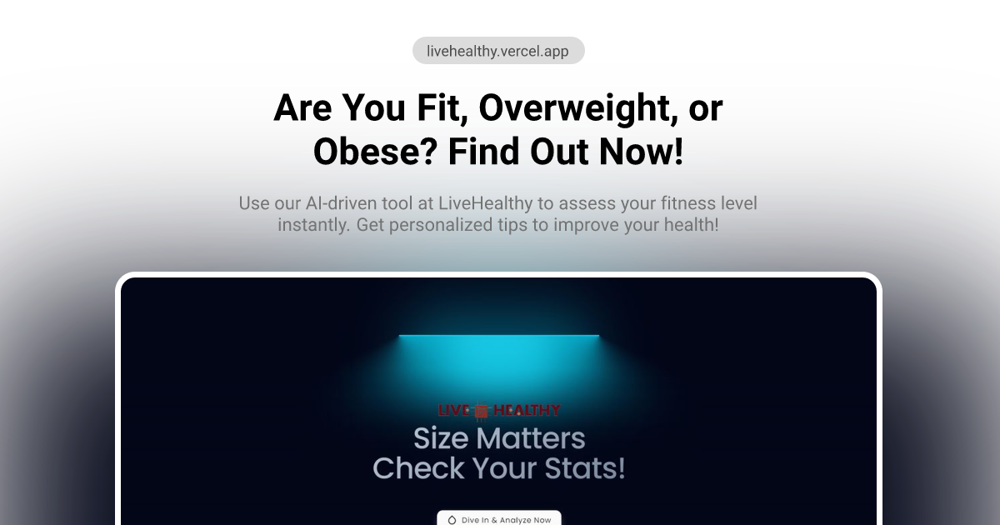

# LiveHealthy

AI-powered health assessment tool that predicts obesity risk using machine learning.



## Overview

LiveHealthy analyzes 16 health factors including diet, physical activity, and lifestyle habits to provide instant, personalized health insights with 95% accuracy.

## Features

- **Instant Analysis** - Get results in under 3 seconds
- **Privacy First** - No data stored on servers
- **Accurate** - Trained on WHO health research data
- **Responsive** - Works on desktop and mobile

## Project Structure

```
livehealthy/
├── frontend/       # React + TypeScript + Vite
├── backend/        # Flask + scikit-learn
└── README.md
```

## Quick Start

### Backend

```bash
cd backend
python -m venv venv
venv\Scripts\activate
pip install -r requirements.txt
flask run
```

### Frontend

```bash
cd frontend
npm install
npm run dev
```

Open [http://localhost:5173](http://localhost:5173)

## Tech Stack

| Layer | Technology |
|-------|------------|
| Frontend | React 19, TypeScript, Tailwind CSS |
| Backend | Flask, scikit-learn |
| Fonts | Outfit, Playfair Display |
